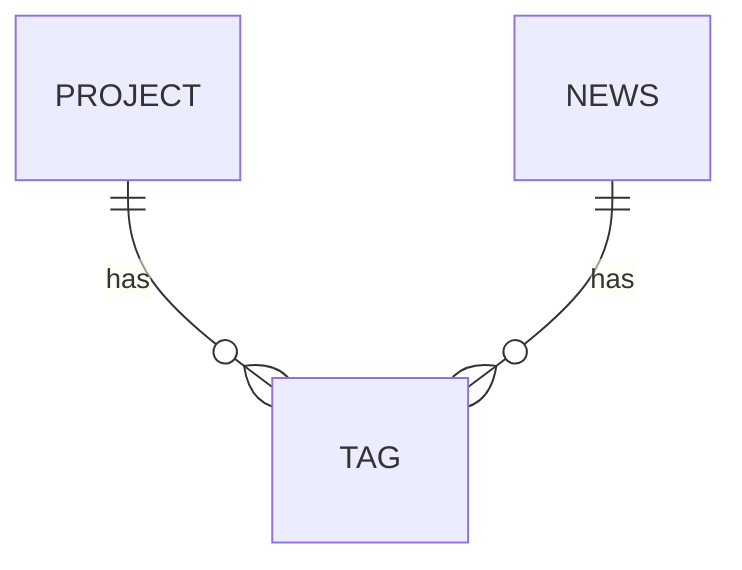

# Vista general de datos — MiniDts-Hub

```mermaid
erDiagram
  PROJECT ||--o{ TAG : has
  NEWS ||--o{ TAG : has
```

Los datos se leen de `src/content/projects/*.toml` y `src/content/news/*.toml` en build.